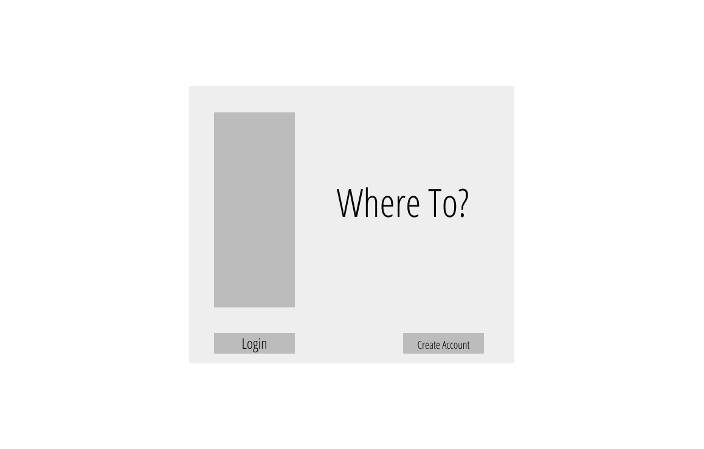

# :airplane: Where To?

## Table of Contents

  1. [Description](#description)
  2. [Demo](#demo)
  3. [Ingredients](#woman_technologist-ingredients)
  4. [Features](#rocket_features)
  5. [Wireframes](#framed_picture-wireframes)
  6. [User Stories](#spiral_notepad-user-stories)
  7. [Images](#camera_flash-images)
  8. [Coming Soon](#ice_cube-coming-soon)
  9. [How To Use](#sparkles-how-to-use)

## Description

Where To? is an application to help plan for upcoming trips. I built this for purely selfish reasons! As a planner, I make so many lists when preparing and packing for a trip. I have information in multiple locations, multiple files, and multiple medias. I wanted to create something simple that could store all of this information, and Where To? was born.

This version allows website visitors to create an account, log in and out, and CRUD some trip itineraries! I'm looking forward to the next iteration of this project, which include features such as a mobile app, an even better responsive design, automated reminders, and more personalization. 

Where To? was built using Next.js (using React.js), uses Firebases for authentication and its database, and is deployed on Vercel--one of my favorite deployment platforms.

## Demo

https://where-to.vercel.app/

## :woman_technologist: Ingredients
***Please refer to the ``RESOURCES.md`` file for credit and citation information.***

-   Languages:

    -   HTML5
    -   CSS3
    -   JavaScript / ES6

-   Design:

    -   Tailwind CSS
    -   Google Fonts
    -   Figma
    -   SweetAlert
    -   NProgress

-   [Pivotal Tracker](https://www.pivotaltracker.com/projects/2494463)

-   Build:

    -   VS Code
    -   Firebase
    -   Firestore
    -   Next.js
    -   Vercel

## :rocket: Features

-   Mobile-friendly, responsive design

-   User account creation, log in, log out

-   Create, read, update, and delete itineraries

-   Emailed itineraries

## :framed_picture: Wireframes




## :spiral_notepad: User Stories


## :camera_flash: Images


## :ice_cube: Coming Soon

- [ ] Responsive design improvements on landing page
- [ ] iOS / Android app
- [ ] Email + SMS reminders
- [ ] Weather, travel advisory, + Google Maps integration
- [ ] Settings page, tutorial, and calendar on sidebar
- [ ] Past trips on dashboard
- [ ] Confirmation modals for deletions
- [ ] Ability to add trips that don't involve flying

## :sparkles: How To Use

First, clone the repository, then 

```bash
npm install

npm run dev
```
The app will be up and running in ```http://localhost:3000```. Note that you'll need to create accounts with Firebase and EmailJS and store those credentials in a ```.env.local``` file. 

This app uses [Tailwind CSS](https://www.tailwindcss.com). To control the generated stylesheet's filesize, the ```purge``` option was used to remove unused CSS.
